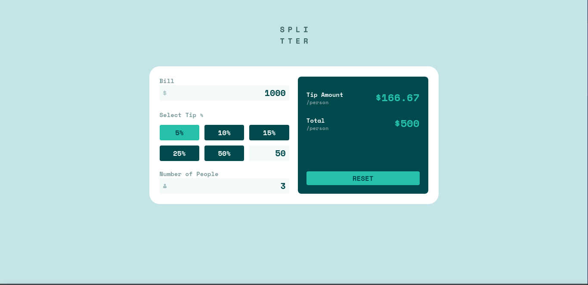
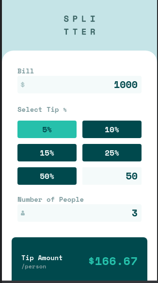
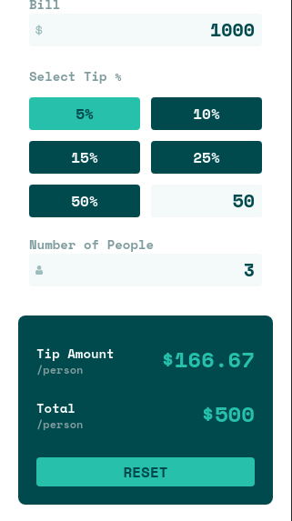

# Frontend Mentor - Tip calculator app solution

This is a solution to the [Tip calculator app challenge on Frontend Mentor](https://www.frontendmentor.io/challenges/tip-calculator-app-ugJNGbJUX). Frontend Mentor challenges help you improve your coding skills by building realistic projects.

## Table of contents

- [Overview](#overview)
  - [The challenge](#the-challenge)
  - [Screenshot](#screenshot)
  - [Links](#links)
- [My process](#my-process)
  - [Built with](#built-with)
  - [What I learned](#what-i-learned)
  - [Useful resources](#useful-resources)
- [Author](#author)

## Overview

### The challenge

Users should be able to:

- View the optimal layout for the app depending on their device's screen size
- See hover states for all interactive elements on the page
- Calculate the correct tip and total cost of the bill per person

### Screenshot


 

### Links

- Solution URL: [GitHub Repo](https://github.com/SevroAuBarca/FEM-tip-calculator-app)
- Live Site URL: [Live Site](https://amazing-haupia-e9ea91.netlify.app/)

## My process

### Built with

- Semantic HTML5 markup
- Flexbox
- CSS Grid
- Mobile-first workflow
- [React](https://reactjs.org/) - JS library
- [TypeScript](https://www.typescriptlang.org/) - JS With Types
- [Tailwind CSS](https://tailwindcss.com/) - For styles
- [Vite](https://vitejs.dev/) - JS Builder

### What I learned

A custom hook to manage the inputs:

```js
const useField = (setState: Dispatcher<number | undefined>) => {
  const onChange = (event: React.ChangeEvent<HTMLElement>) => {
    const target = <HTMLTextAreaElement>event.target;
    if (target.type === "number") {
      const { value } = target;
      setState(parseInt(value));
    } else {
      const { id } = target;
      setState(parseInt(id));
    }
  };

  return { onChange };
};
```

### Useful resources

- [TypeScript cheatsheet](https://react-typescript-cheatsheet.netlify.app/docs/basic/setup) - This helped me put the types on my app correctly
- [TailWind CheatSheed](https://github.com/gojutin/tailwind-cheatsheet) - Amazing repisitorie for search taindwind classes fast and easy, helps a lot to find classes if i am offline.

## Author

- Frontend Mentor - [@SevroAuBarca](https://www.frontendmentor.io/profile/SevroAuBarca)
- Twitter - [@ZeroTheFasteer](https://www.twitter.com/ZeroTheFasteer)
- Instagram - [<Daniel.Contreras />](https://www.instagram.com/daniel.au.lune/)
